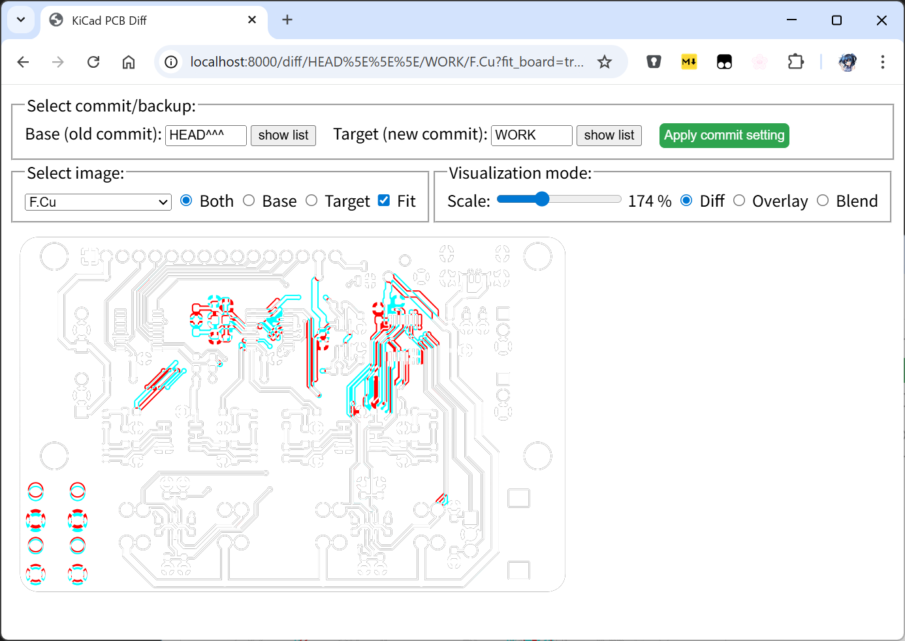

# kicad-diff-visualizer
A tool to visualize differences in PCB layouts and schematics created with KiCad.

This tool recognizes a Git repository and auto-backups,
and visualizes the difference between two versions.
Typical use cases include:
- Writing commit logs: it helps you recall design changes.
- Reviewing commit history: visual diffs are easier to understand than text diffs.

One of the key features of this tool is its minimal reliance on external dependencies.
It leverages `kicad-cli`, which comes bundled with KiCad,
to generate images for each commit and calculate the differences.

## Requirements

- `git` command
  - Ubuntu: `sudo apt install git`
- Jinja >= 2.10
  - Ubuntu: `sudo apt install python3-jinja2`
- GitPython >= 3.0 (for tests)
  - Ubuntu: `sudo apt install python3-git`

This program has been tested on Ubuntu running under WSL2.
Please test it on your environment and send a report or a pull request.

## Screenshot

The server shows the PCB layout differences.
- White: no diff
- Red: only in the old commit
- Blue: only in the new commit

Shcematics can be showen as well.

## How to use

    $ ./run_server.sh /path/to/kicad_project_dir

or

    $ cd /path/to/kicad_project_dir
    $ /path/to/kicad-diff-visualizer/run_server.sh

Then, open http://localhost:8000/ with a Web browser.

`kicad_project_dir` refers to the directory containing a .kicad_pro file.
Alternatively, you may directly specify paths to .kicad_pcb and/or .kicad_sch.

Once a page is opened, you can change the "Base" and "Target" versions individually.
Click the "show list" button to view available versions, including Git commits and auto-backups located in the `<proj>-backups` directory.
You can select a version from the list or enter its name directly in the text box.
Version names follow these formats: `YYYY-MM-DD` for auto-backups and SHA-1 hashes for Git commits.

## Configuration

Copy `kidivis_sample.ini` to `kidivis.ini`, then modify it as needed.
To use a different configuration file, pass the `--conf` option to `run_server.sh`.
